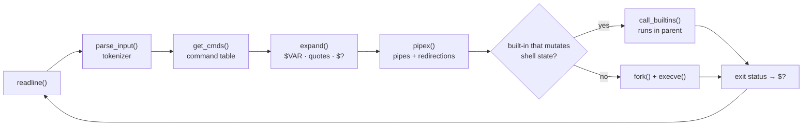

# Minishell

A POSIX-like interactive shell written in C, built from scratch around `readline`, `fork`/`execve`, and manual signal handling.

> Cleaned portfolio version of a Codam / 42 project. Team project of two, built with [@AbdoElbo](https://github.com/AbdoElbo).

**TL;DR:** A working `bash`-like shell — pipes, redirections, heredocs, environment expansion, built-ins, and signal handling — connected into one program whose whole job is turning a typed line into a correctly-wired tree of processes.

## Overview

Minishell reimplements the core interactive loop of a Unix shell: it reads a line, parses it into tokens, expands variables, builds a pipeline of commands, and executes it — while behaving like `bash` for signals, built-ins, redirections, and quoting.

This project matters because it forces you to actually understand the things a shell hides from you every day: how a command line becomes a process tree, how file descriptors are wired together for pipes and redirections, how a parent shell talks to `readline` without breaking `Ctrl-C`, and where a "simple" feature like environment variable expansion turns into a surprising number of edge cases.

## Demo

```console
Minishell$ export GREETING=world
Minishell$ echo "$GREETING" | tr a-z A-Z
WORLD
Minishell$ ls | wc -l
7
Minishell$ pwd
/home/user/portfolio/Minishell
Minishell$ echo $?
0
Minishell$ exit
```

## Features

- Interactive prompt built on GNU `readline`, with command history
- Command execution via `fork` + `execve`, respecting `PATH`
- Pipelines (`cmd1 | cmd2 | cmd3 ...`)
- Redirections: `<`, `>`, `>>`, and heredocs (`<<`)
- Quoting rules for `'single'` and `"double"` quotes (including expansion differences between them)
- Environment variable expansion (`$VAR`, `$?`, `$0`) inside unquoted and double-quoted tokens
- Built-ins implemented manually (not delegated to the OS): `cd`, `echo`, `exit`, `export`, `pwd`, `env`, `unset`
- Signal handling that mirrors `bash`: `Ctrl-C` interrupts the current line without killing the shell, `Ctrl-\` is ignored at the prompt, and both behave correctly while a child process is running
- Correct exit-status propagation (`$?`) across built-ins, pipelines, and signals

## Architecture



Each line goes through four independent stages — tokenize, group into commands, expand, execute — with a well-defined data structure handed between them (`t_token` list → `t_cmds` table). Keeping the stages separate is what made the project debuggable: a wrong expansion or a broken redirection can be traced to exactly one stage.

## Project Structure

```text
Minishell/
├── include/             # Shared headers (minishell.h, builtins.h, expand.h, pipex.h, lists.h)
├── libft/               # Custom C standard-library replacement (42's libft)
├── src/
│   ├── minishell.c      # Entry point: prompt loop, signal setup
│   ├── builtins/        # cd, echo, exit, export, pwd, env, unset
│   ├── expansion/       # Variable/quote expansion of tokens
│   ├── pipex/           # Pipeline construction, forking, redirections
│   └── utils/           # Tokenizing, command-table building, env helpers, cleanup
└── Makefile
```

## Technical Challenges

- **Signals vs. readline.** `SIGINT`/`SIGQUIT` have to behave differently depending on whether the shell is idle at the prompt, mid-parse, or waiting on a child process. Getting `Ctrl-C` to redraw a clean prompt (via `rl_on_new_line` / `rl_replace_line`) without corrupting readline's internal state took real trial and error.
- **Redirection and heredoc file descriptor juggling.** Every redirection (`<`, `>`, `>>`, `<<`) has to be applied in the right order, restored correctly between pipeline stages, and cleaned up if parsing fails halfway through — this is where most of the memory/fd leaks lived during development.
- **Quoting-aware expansion.** `$VAR` expands inside double quotes but not single quotes, and unquoted expansions can themselves introduce new word splits. Handling this without a full shell grammar required careful, incremental token-by-token logic.
- **Debugging a multi-process program.** Because the shell forks children for every non-builtin command, print-debugging often wasn't enough — GDB with `follow-fork-mode` was essential to step through parent and child execution separately and catch bugs that only showed up in one branch of the fork.

## Design Decisions

- **Built-ins that mutate shell state run in the parent, never in a fork.** `cd`, `export`, `unset`, and `exit` change the shell's own working directory or environment; run them in a forked child and the change dies with the child. Everything else forks — exactly the split a real shell makes.
- **All per-line state is rebuilt every prompt iteration.** Each line gets a fresh token list and command table (`init_total` per loop), so there is one cleanup path and no long-lived parser state to corrupt between commands.
- **Expansion is a separate stage after command grouping, not part of the tokenizer.** Quote handling and `$` expansion are hairy enough on their own; keeping them out of the tokenizer meant each stage stayed small enough to test and debug in isolation.
- **The signal handler does the minimum async-signal-safe work.** It sets a single `volatile sig_atomic_t` flag and redraws the prompt; every real decision about interrupted state happens synchronously in the main loop where it's safe.

## What I Learned

- How a shell actually turns a typed line into running processes — not as an abstraction, but as code we wrote and debugged ourselves
- Why signal handling around `readline` is genuinely hard, and how `bash` gets away with looking simple
- How to reason about process trees and file descriptors when debugging, instead of only reasoning about single-threaded control flow
- The value of GDB for anything involving `fork()` — print statements stop being reliable once a bug depends on interleaving between parent and child

## Build & Run

```bash
make
./minishell
```

Requires `libreadline` development headers (`libreadline-dev` on Debian/Ubuntu).

```bash
make clean   # remove object files
make fclean  # remove object files and the binary
make re      # rebuild from scratch
```

## Limitations

- Not a drop-in `bash` replacement — no scripting, job control, or subshells (`(...)`)
- No support for `&&` / `||` / `;` command chaining
- Designed for interactive use; built as a Codam evaluation project, not hardened for production or untrusted input

## Future Improvements

- Command chaining with `&&`, `||`, and `;`
- Basic job control (`jobs`, `fg`, `bg`, `&`)
- Wildcard/glob expansion
