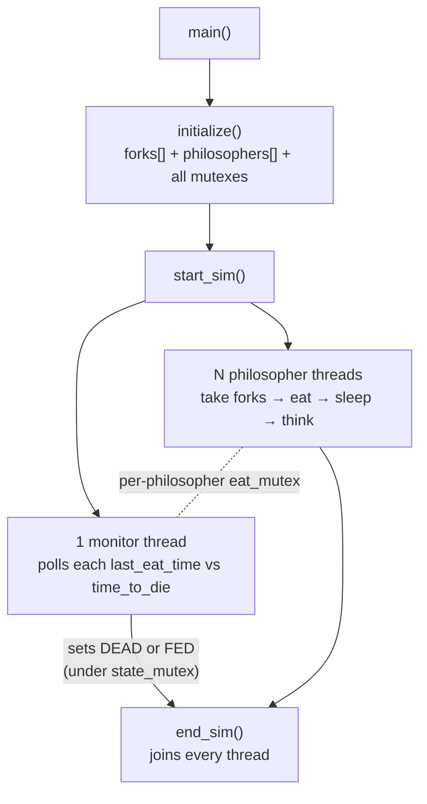

# Philosophers

A C implementation of the classic Dining Philosophers problem using POSIX threads and mutexes — built to reason correctly about deadlock, starvation, and precise timing under concurrency.

> Cleaned portfolio version of a Codam / 42 project. Solo project.

**TL;DR:** Dining Philosophers solved with threads and mutexes — the interesting part is proving it can't deadlock and hitting millisecond-accurate death timing with a custom busy-wait loop.

## Overview

Each philosopher is a thread that repeatedly thinks, eats, and sleeps. Eating requires holding two shared forks (mutexes) at once, which is exactly the setup that makes this problem a standard teaching example for deadlock: if every philosopher grabs their left fork at the same time, no one can ever get a right fork, and the whole system freezes.

The project is a mutex/thread exercise, but the harder part in practice is the **timing model**: a philosopher must be declared dead the moment `time_to_die` milliseconds pass without eating — not "soon after", not "eventually", but as close to exactly on time as a userspace program can manage. That constraint shapes almost every design decision in the codebase, from the custom busy-wait sleep to how the death-watch thread is structured.

## Demo

```console
$ ./philo 5 800 200 200 3
0 2 has taken a fork
0 2 has taken a fork
0 2 is eating
0 4 has taken a fork
0 4 has taken a fork
0 4 is eating
200 2 is sleeping
200 4 is sleeping
200 1 has taken a fork
...
```

Each line is `<ms since start> <philosopher id> <state>` — the log itself is part of the exercise: no two lines may interleave, and no philosopher may log anything after a death.

## Features

- One thread per philosopher, plus a dedicated monitor thread that watches for deaths and (optionally) full satiation
- Deadlock avoided by breaking the symmetric lock order: even-numbered philosophers pick up their left fork first, odd-numbered philosophers pick up their right fork first
- Fork acquisition, eating, sleeping, and thinking states, each timestamped and logged
- Accurate timekeeping via `gettimeofday`, with a custom `ft_usleep` that busy-waits in short increments rather than trusting `usleep` for the full duration
- Optional meal limit (`number_of_times_each_philosopher_must_eat`) — simulation stops cleanly once everyone has eaten enough
- Correct handling of the one-philosopher edge case (a single philosopher can never acquire two forks, and must simply starve on schedule)
- Clean shutdown: once a death or "everyone has eaten enough" condition is detected, no philosopher prints a state change after that point

## Architecture



The monitor thread doesn't hold a global lock while scanning — it locks only the one philosopher's `eat_mutex` it is currently inspecting, so it never blocks a philosopher who is mid-meal on an unrelated fork.

## Project Structure

```text
Philosophers/
├── include/
│   └── philosophers.h    # Shared types (t_philo, t_total), state enum, prototypes
├── src/
│   ├── philosophers.c    # main(), fork acquisition/eating logic
│   ├── initialize.c      # Argument-driven setup of forks, philosophers, mutexes
│   ├── simulation.c      # Thread routine, monitor thread, start/end of simulation
│   ├── input_check.c     # Argument validation
│   ├── utils.c           # Timing helpers, state transitions
│   └── free.c            # Mutex destruction / cleanup
└── Makefile
```

## Technical Challenges

- **Deadlock avoidance.** With every philosopher trying to lock "left fork, then right fork", a naive implementation deadlocks as soon as all of them lock their left fork simultaneously. Breaking the symmetry (even philosophers reach for left first, odd for right first) guarantees at least one philosopher in any ring can always acquire both forks.
- **Sub-millisecond timing accuracy.** `usleep()` alone isn't reliable enough to hit a death deadline precisely — oversleeping by even a few milliseconds can make a simulation report a death that shouldn't have happened.
- **Avoiding false positives after the simulation ends.** Once a philosopher dies or the meal quota is met, other threads may already be mid-print or mid-loop. `print_message` checks the shared `state` (under `state_mutex`) before printing, so no philosopher logs a state change after the simulation has effectively ended.
- **The one-philosopher case.** With a single philosopher there is only one fork, so a normal two-fork acquisition can never succeed. This has to be special-cased: the philosopher picks up their one fork, is logged as holding it, and starves out naturally at `time_to_die`.

## Design Decisions

- **Fork-acquisition order alternates by philosopher parity.** Everyone locking left-then-right deadlocks the moment all N philosophers grab their left fork simultaneously; having odd philosophers reach right-first breaks the symmetry, so someone can always make progress.
- **A custom `ft_usleep` busy-wait instead of one big `usleep`.** `usleep` may oversleep by several milliseconds; sleeping in sub-millisecond chunks and re-checking the clock each iteration trades a little CPU for the timing precision the death check is graded on.
- **Per-philosopher `eat_mutex` instead of one global lock.** The monitor only locks the philosopher it is currently checking, so monitoring and simulation never serialize each other.
- **A single monitor thread owns the death/satiation verdict.** Philosophers never decide anyone is dead; one thread evaluates every `last_eat_time`, which makes the "died" message impossible to race or print twice.

## What I Learned

- How to reason about deadlock and race conditions concretely, not just in theory — by designing a fork-acquisition order that provably can't deadlock
- Why "sleep for approximately the right time" is not good enough when correctness is judged on millisecond-level timing, and how to build a busy-wait loop that actually delivers that precision
- How to scope mutex locking as tightly as possible so that monitoring and simulation don't serialize each other unnecessarily
- How subtle shutdown ordering can be in a multithreaded program — a "finished" flag isn't enough on its own if other threads can still act on stale state after it flips

## Build & Run

```bash
make
./philo <number_of_philosophers> <time_to_die> <time_to_eat> <time_to_sleep> [number_of_times_each_philosopher_must_eat]
```

Example:

```bash
./philo 5 800 200 200
./philo 4 410 200 200 10
```

```bash
make clean   # remove object files
make fclean  # remove object files and the binary
make re      # rebuild from scratch
```

## Limitations

- Single-process, thread-based only — there's no equivalent process-based (fork + semaphore) version
- Not tuned for very large philosopher counts; timing precision assumptions are calibrated for the ranges used in evaluation, not stress-tested at scale
- Built as a Codam evaluation project, not hardened for production use

## Future Improvements

- A process-based variant using `fork()` and named semaphores, to compare against the thread/mutex approach
- Automated test harness that runs a matrix of timing parameters and checks for both unexpected deaths and missed deaths
