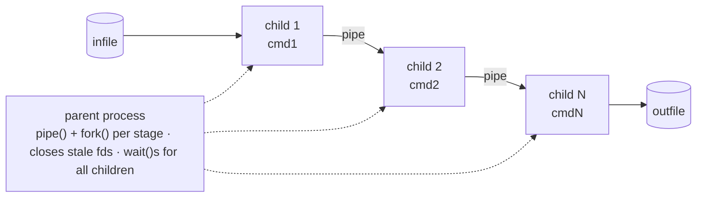

# Pipex

A C reimplementation of shell piping (`cmd1 | cmd2`) built directly on `fork`, `pipe`, `dup2`, and `execve` — no shell involved.

> Cleaned portfolio version of a Codam / 42 project. Solo project.

**TL;DR:** Reimplements `< infile cmd1 | cmd2 > outfile` by hand with raw `fork`/`pipe`/`dup2`/`execve`. The bonus build generalizes to N piped commands plus heredoc input.

## Overview

`pipex` takes the shell syntax `< infile cmd1 | cmd2 > outfile` and reproduces exactly what the shell does under the hood: open the input file, create a pipe, fork two child processes, wire each child's stdin/stdout to the right end of the pipe or file, and `execve` the actual commands. The bonus version generalizes this to an arbitrary number of piped commands and adds heredoc (`here_doc`) input, matching how `bash` itself extends the two-command case.

This is a small project on paper, but it's the clearest place to actually understand process creation, file descriptor duplication, and PATH resolution — the exact mechanics a shell like [Minishell](../Minishell) is built on top of.

## Demo

```console
$ echo "foo bar baz" > infile.txt
$ ./pipex infile.txt "grep bar" "wc -l" outfile.txt
$ cat outfile.txt
1

$ make bonus
$ ./pipex infile.txt "grep bar" "cat" "wc -l" outfile.txt   # N commands
$ cat outfile.txt
1
```

## Features

- Executes an arbitrary-length pipeline of commands (bonus), each as its own child process
- Manual `PATH` resolution and lookup of each command's executable, replicating what the shell does before it ever calls `execve`
- Correct file-descriptor lifecycle: every pipe end and file descriptor is closed at the right point in the right process, so pipelines don't hang waiting on a descriptor no one closed
- Bonus `here_doc` mode: reads standard input until a delimiter, then feeds it into the pipeline exactly like `<< EOF` in a real shell
- Graceful handling of command-not-found and file-open failures, matching shell-like exit codes instead of crashing

## Architecture



Each intermediate child only ever knows about the pipe it was given — the parent process is the one responsible for closing stale descriptors and handing the next child a clean read end, which is what keeps the whole pipeline from deadlocking on an open write end nobody uses anymore.

## Project Structure

```text
Pipex/
├── include/
│   └── pipex.h          # Shared t_data struct, prototypes, IN/OUT/APPEND enum
├── src/
│   ├── pipex.c          # Mandatory part: two-command pipeline
│   ├── parsing.c        # Argument splitting + PATH resolution
│   ├── helpers.c        # Command lookup, setup/init helpers
│   └── cleanup_utils.c  # Resource cleanup, wait()/exit-code handling
├── src_bonus/
│   ├── pipex_bonus.c    # N-command pipeline + here_doc entry point
│   └── bonus_helper.c
├── libft/               # Custom C standard-library replacement (42's libft)
└── Makefile
```

## Technical Challenges

- **File descriptor bookkeeping across forks.** A `fork()`'d child inherits every open descriptor, not just the ones it needs. Forgetting to close an unused pipe end in either the parent or a child is the classic pipex bug — it doesn't crash, it just hangs forever because a reader is still waiting on a write end that's technically still open somewhere.
- **PATH resolution without a shell.** `execve` requires a full or relative path to the binary — it does no `PATH` lookup itself. `parsing.c` reimplements that lookup manually: reading `PATH` out of `envp`, splitting it, and trying each directory until the command resolves.
- **Extending two commands to N commands (bonus).** The mandatory version hardcodes a single pipe between exactly two commands. The bonus version turns that into a loop that creates a new pipe per stage and threads the previous stage's read end into the next child — the same pattern `bash` uses internally for `cmd1 | cmd2 | cmd3 | ...`.
- **Heredoc semantics (bonus).** `here_doc` mode has to read from the real stdin, watch for the delimiter line, and only then start the pipeline — while still cleaning up correctly if the input ends early.

## Design Decisions

- **The parent owns descriptor lifetime.** Children touch only the pipe ends they inherit; the parent closes the stale read/write ends at each stage of the loop. This single rule is what prevents the classic "pipeline hangs forever" failure mode.
- **`PATH` is resolved once, up front.** The environment's `PATH` is split into a directory list during setup and every command resolves against it, instead of re-parsing the environment per command.
- **Mandatory and bonus share one core.** Parsing, helpers, and cleanup are common source files; the bonus adds an N-stage loop and a `here_doc` entry point rather than forking the codebase into two diverging copies.
- **A failed file open falls back to `/dev/null` instead of aborting the pipeline.** This mirrors `bash`, where `< missing cmd1 | cmd2` still runs `cmd2` — the error is reported, but the rest of the pipeline behaves predictably.

## What I Learned

- What a shell actually does, mechanically, between typing `cmd1 | cmd2` and seeing output — this project turns "the shell pipes things" from an abstraction into code I wrote and debugged myself
- Why nearly every "pipex hangs forever" bug is a file-descriptor leak, and how to reason about which process needs which end of which pipe open at every point in time
- How to manually reimplement a piece of shell behavior (`PATH` resolution) that's normally invisible
- How to generalize a two-case solution (one pipe) into an N-case solution (a loop over pipes) without rewriting the core logic

## Build & Run

```bash
make          # mandatory part: exactly two piped commands
./pipex infile "cmd1" "cmd2" outfile

make bonus    # bonus part: N piped commands, plus here_doc support
./pipex infile "cmd1" "cmd2" "cmd3" ... outfile
./pipex here_doc LIMITER "cmd1" "cmd2" outfile
```

```bash
make clean   # remove object files
make fclean  # remove object files and the binary
make re      # rebuild from scratch
```

## Limitations

- The mandatory build only supports exactly two piped commands; N-command pipelines require `make bonus`
- No shell parsing beyond simple space-separated arguments — no quoting, globbing, or redirection operators inside the command strings themselves
- Built as a Codam evaluation project, not hardened for production or untrusted input

## Future Improvements

- Quoting-aware command parsing (reusing ideas from the Minishell tokenizer)
- A small test suite comparing `pipex` output against the equivalent real shell pipeline across a range of inputs
