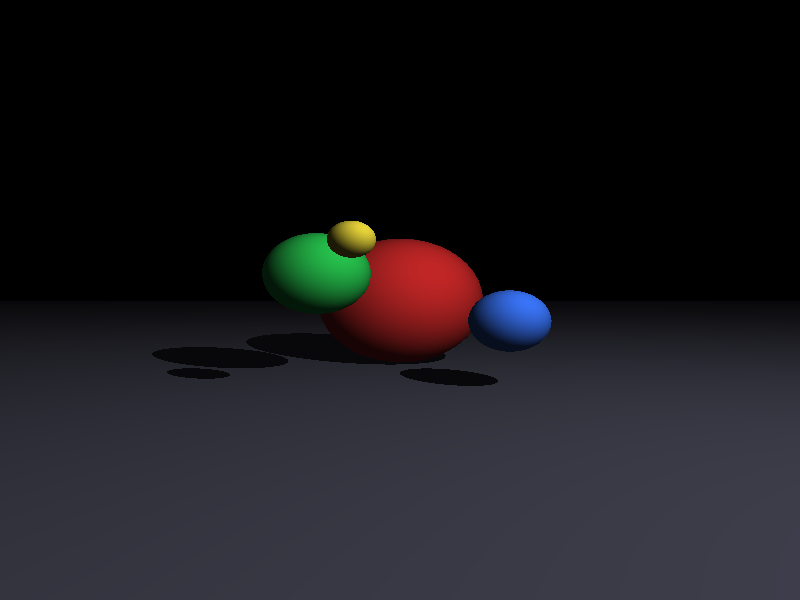
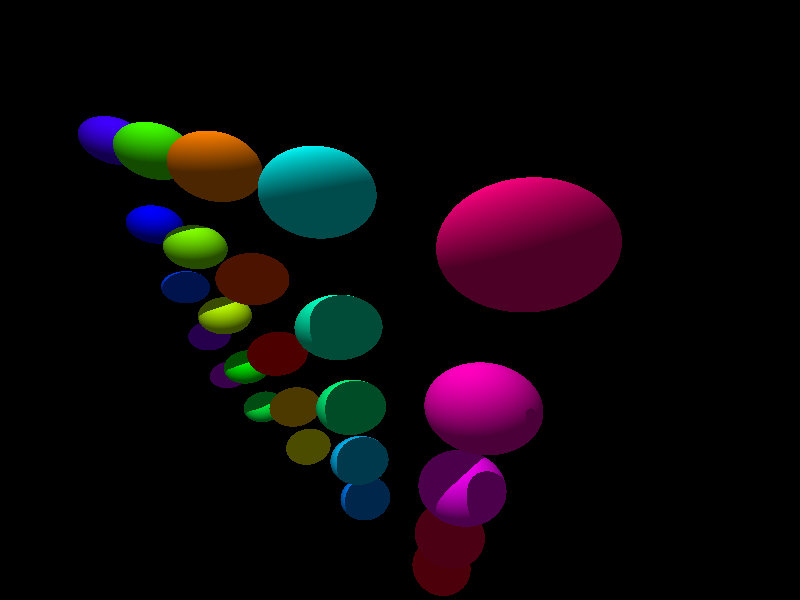
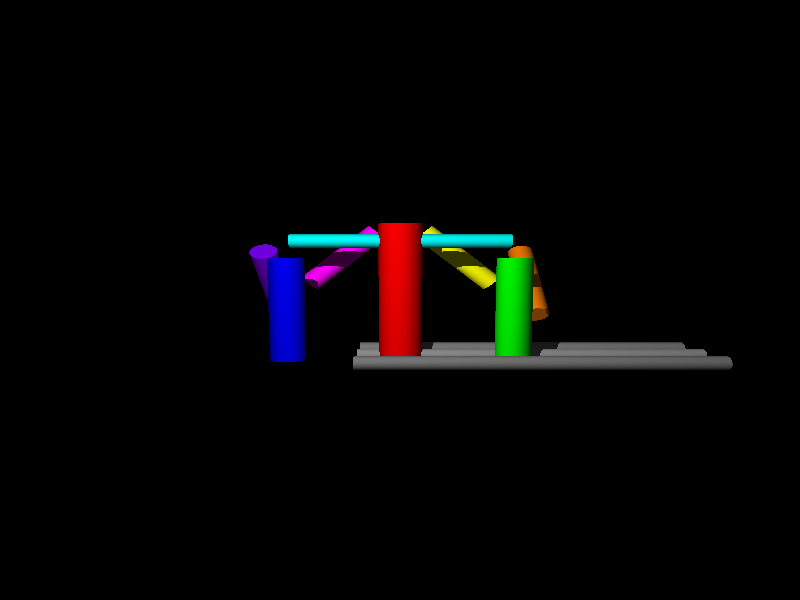
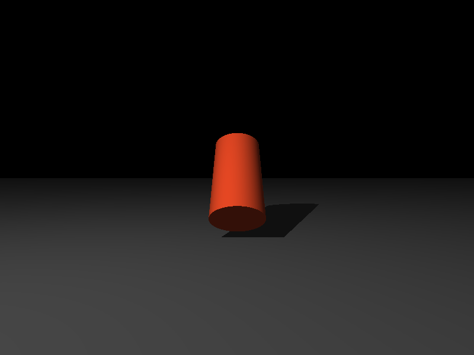
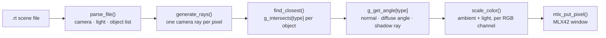

# miniRT

A CPU ray tracer in C that renders spheres, planes, and capped cylinders with diffuse lighting and hard shadows, displayed through [MLX42](https://github.com/codam-coding-college/MLX42).

> Cleaned portfolio version of a Codam / 42 project. Team project of two, built with [@fdreijer](https://github.com/fdreijer).

**TL;DR:** Reads a scene description file, shoots one ray per pixel through a movable camera, solves the ray–object intersection math analytically for each shape, and shades every hit with ambient + diffuse lighting and shadow rays — no graphics API doing the work for you.

## Renders

|  |  |
|:--:|:--:|
| `scenes/scene16.rt` — spheres, plane, hard shadows | `scenes/scene3.rt` — 25-sphere spiral |
|  |  |
| `scenes/scene12.rt` — capped cylinders only | `scenes/scene14.rt` — cylinder caps + shadow |

All images are straight program output, captured from the MLX42 window at 800×600 (`WIDTH`/`HEIGHT` in `inc/miniRT.h`; the committed default is 100×100 for fast test renders).

## Overview

miniRT is a minimal ray tracer built from first principles: there is no rendering library underneath doing the geometry — MLX42 only puts finished pixels on screen. Everything else is vector math written by hand: camera ray generation from a configurable FOV, quadratic intersection solving, surface normals, a diffuse lighting model, and occlusion testing for shadows.

The project's real subject is **turning geometry into code you can debug**. When a rendered image is wrong, there's no error message — a cylinder cap renders as a hole, a shadow bends the wrong way, a sphere is subtly egg-shaped — and the only way forward is to trace the math itself: which normal was flipped, which quadratic root was picked, which vector wasn't normalized.

## Features

- Scene description via `.rt` files: ambient light, camera (position, orientation, FOV), a point light, and any number of objects
- Three primitives, each with analytic intersection math:
  - **Spheres** — quadratic ray–sphere intersection
  - **Planes** — signed-distance intersection with two-sided normals
  - **Cylinders** — finite, *capped* cylinders: quadratic intersection against the wall, clamped to the cylinder's height, plus separate disc intersections for both end caps
- Diffuse (Lambertian) shading from a point light, plus ambient light, per RGB channel
- Hard shadows: every hit point casts a ray back toward the light and is darkened if any other object blocks it
- Correct normals everywhere — including the three-way split on a cylinder (top cap / bottom cap / curved wall) and flipping normals that face away from the viewer
- 18 test scenes included, from single-object sanity checks to multi-object compositions
- ESC or window close exits cleanly with all allocations freed

## Scene Format

```text
A 0.2   255,255,255            # ambient: ratio, color
C 0,0,-120  0,0,1  70          # camera: position, direction, FOV
L 0,0,0  1.0  255,255,220      # light: position, brightness, color

sp 0,0,60    15  255,220,50    # sphere: center, diameter, color
pl 0,-12,0   0,1,0  220,220,220        # plane: point, normal, color
cy 0,-20,60  0,1,0  0.5 40  255,255,255  # cylinder: center, axis, diameter, height, color
```

## Architecture



Rendering is two-phase per pixel: first find the closest intersection across all objects, then shade only that one hit. Each geometric operation is dispatched through function-pointer tables indexed by object type (`g_intersects`, `g_get_angle`, `g_get_color`), so adding a new primitive means adding three functions and three table entries — no `if`-chains through the renderer.

## Project Structure

```text
miniRT/
├── inc/
│   ├── miniRT.h               # Types, prototypes, dispatch tables
│   ├── libft/                 # Custom C standard-library replacement
│   └── MLX42/                 # Vendored MLX42 graphics library
├── scenes/                    # 18 .rt test scenes
├── src/
│   ├── main.c                 # Arg validation, MLX42 window setup, hooks
│   ├── rays.c                 # Ray generation, closest-hit search, shading
│   ├── intersects.c           # Sphere & plane intersection + normals
│   ├── intersects_cylinder.c  # Cylinder wall + cap intersection + normals
│   ├── helpers.c              # Quadratic setup, shared math helpers
│   ├── parsing/               # .rt file parsing and validation
│   ├── vector_helpers/        # Vector algebra (dot, cross, normalize, ...)
│   └── free_exit.c            # Cleanup paths
└── Makefile
```

## Technical Challenges

- **Capped cylinders are three surfaces pretending to be one.** The wall is a quadratic like a sphere, but its solutions must be rejected when the hit point projects outside the cylinder's height. The two caps are disc intersections on their own planes. Getting a seamless object out of the three — closest hit wins, correct normal per surface — is where most of the debugging lived.
- **Normals are easy to get almost right.** A normal that's flipped, unnormalized, or taken from the wrong surface doesn't crash anything — it produces lighting that's subtly wrong (inside-out shading, shadow acne, black seams at cap edges). Debugging meant reasoning backward from the image to the math.
- **Shadow rays that don't shadow themselves.** The occlusion test has to ignore the surface the ray starts on and stop at the light's distance — otherwise objects shadow themselves through floating-point noise, or something *behind* the light darkens the scene.
- **A camera that matches its spec.** FOV, aspect ratio, and the camera's orientation basis (forward/right/up) all interact; small mistakes make scenes render stretched or mirrored rather than obviously broken.

## Design Decisions

- **Function-pointer dispatch instead of type switches.** Intersection, shading, and color lookup are all `table[object->type](...)` calls. The renderer never knows which shapes exist — a new primitive plugs into the tables without touching `trace_ray`.
- **Two-phase tracing: find the closest hit first, shade once.** Shading (normal computation + shadow ray) is much more expensive than intersection testing, so it runs only for the single winning object per pixel, not for every candidate along the ray.
- **All geometry uses one shared vector toolkit.** Every intersection routine is written in terms of `v_add`/`v_sub`/`v_dot`/`v_cross`/`v_normalize`, keeping the math readable enough to compare directly against its derivation on paper.
- **Scenes are data, not code.** All geometry lives in `.rt` files, so testing an edge case (camera inside an object, light behind a plane, overlapping spheres) means writing a text file, not recompiling.

## What I Learned

- How ray tracing actually works end-to-end — from camera model to intersection math to shading — at the level of individual dot products, not framework calls
- How to derive and implement analytic intersection tests, and how quadratic edge cases (grazing hits, negative roots, near-zero coefficients) show up as visual artifacts
- How to debug when the failure signal is a wrong image instead of a wrong value — forming a hypothesis about the math from what the picture looks like
- How to work inside an existing codebase's architecture: understanding the dispatch-table design and the rendering pipeline well enough to extend them without breaking their conventions

## Build & Run

```bash
make
./miniRT scenes/scene10.rt
```

Press `ESC` or close the window to exit.

**Requirements:** `cmake`, `glfw` (`libglfw3-dev`), and OpenGL development headers (`libgl1-mesa-dev` on Debian/Ubuntu) — MLX42 is vendored and built automatically by `make`.

```bash
make clean   # remove object files
make fclean  # also remove the binary
make re      # rebuild from scratch
```

## Limitations

- One point light and ambient light only — no multiple lights, specular highlights, reflections, or refraction
- Single-threaded rendering; large resolutions take visible time to draw
- No spatial acceleration structure — every ray tests every object
- Built as a Codam evaluation project, not a production renderer

## Future Improvements

- Multithreaded rendering (the per-pixel loop is embarrassingly parallel)
- Specular (Phong) highlights and multiple lights
- A bounding-volume hierarchy so scenes with many objects stay fast
